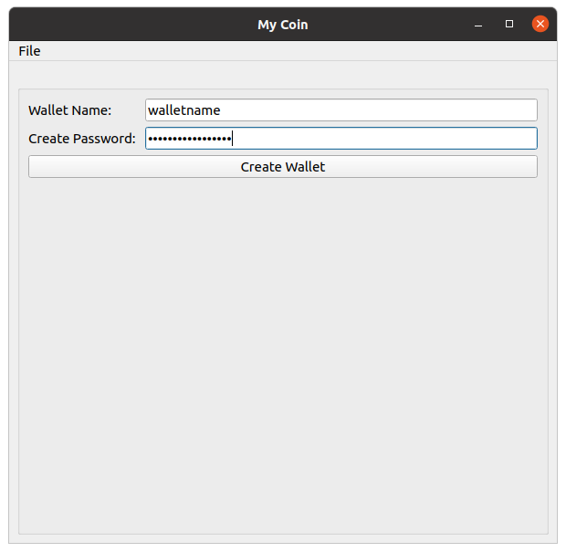

MyCoin
====

*MyCoin* is my implementation of a blockchain cryptocurrency wallet, 
written in python. This project is a compilation of the different coding 
skills and techniques I have studied, and is built for educational purposes.  

How to Use
----

Clone the MyCoin repository, and make sure that the most recent version of python
is installed on your operating system. Install the dependencies in requirements.txt.
I recommend using a virtual environment. Run 'pip install -r requirements.txt --upgrade' 
to install updated dependencies. This [requirements.txt](requirements.txt) file was made on
a linux os, so if you are using windows, you may need to install the dependencies one
by one... This fix is on my todo list.
    
Run [run_proxy.py](run_proxy.py) and [run_server.py](run_server.py) in seperate terminals or 
a multiplexer. Upon execution, the server programs will each ask for a password which is
*"password"*, despite the fact you should never under any circumstances use that as an actual
password. For the purpose of this example, this should not pose to much risk, as long as you
are connecting to local nodes (aka loopback address's like 127.0.0.1/24).

A problem may accure with the validations of ssl certificates. Although I have tested
this on different machines with success, if this is a problem, [here](#Fix_Certs) is a fix.

Then run [app.py](app.py) in another terminal, which provides a gui to 
create a new wallet, and make transactions. 

**Create New Wallet**:

Make a **New Transaction** by going to *file* and click *new transaction*. 
then fill out the form and click the *new transaction* button at the bottom:

Then enter your wallet password when prompted. The maximum number of transactions 
per block is set at two just to see how mining works without having to make up
several transactions. Once the max is reached, the miner starts. View the logs
sent to the terminal running [run_server.py](run_server.py) to get an idea
of what it looks like when [miner.py](miner.py) executes. 

MyCoin Journey
----

I started writing this code a year or so ago, on and off for about a month while
continuing to study other programming skills. Upon finishing what is now a first draft
of this project, this project gathered some dust while I continued my coding journey,
exploring new things and trying to narrow down where my interests reside. Recently (one year later),
I started reanalyzing this project and utilizing some new concepts I have learned. By much
trial and error, I made many changes such as: how data is stored and secured, using ssl to secure
connections, using openssl for personally created certificates, a proxy server to mediate client
requests, and cleaned up some code to be more object-oriented. 

Description
----

### *Storage*

Transactions are stored in a binary file, restricting access to the user who's computer stores the data.
I used linux style permission utilizing python's **os** module to enforce data integrity. The code
for creating the data file is written in a manner meant to protect against a malicious hacker's
attemps to create the data file with permisions allowing access where it is not permitted. This is 
done by creating a file descriptor, implicitly setting permissions, and not allowing a file to be
recreated if it already exists. 

### *SSL Connection*

First personally generated [certificates](ca_certs/) must be generated in order to authenticate a clients 
connection. I did this with the **OpenSSL** cli on linux. From there, python provides a **ssl** module to 
handle authenticating the server and client side certificates. This creates an encrypted socket 
connection for better security. 

### *Proxy Server*

For the [proxy server](services/proxy_server.py), I used **Flask** to handle http connections to the 
[client](services/client.py). This made parsing url endpoints much easier, but does not encrypt the data
being sent. This is not a big deal since this data is meant to be shared on a decentralized peer to peer
network. The proxy parses the client's request and sends forwards the data over a secure connection to 
the [base server](services/base_server.py) which does some sanity checks. The base server handles private
operations and validations, then sends a response to the proxy to be forwarded to the client. The base 
server should only accept connections from the proxy which has should have the proper authentication. 

## *Wallet*

Users create a [wallet](wallet.py) which generates and stores public/private rsa keys in a file that only 
allows access to that user. Before writing this private data to a permission restricted file, the user 
is prompted for a pasword which is used to encrypt the user's rsa keys. The user's stored hashed password 
is compared to the user's inputed password upon another prompt, which is then used to decrypt the rsa keys.
The private key is used to sign a new transaction, and the public key is sent to the server to validate
the authenticity of this transaction before broadcasting it to all nodes on the peer to peer network. 

Credits
----
These two great repositories helped me learn a great deal about how blockchains work:

- [Electrum](https://github.com/spesmilo/electrum)
- [CrankyCoin](https://github.com/cranklin/crankycoin)

Fix_Certs
----
New certificates can be made to replace the ones in the [ca_certs](/ca_certs) directory 
following the same naming scheme as shown below:

    ~/MyCoin/ca_certs$ openssl req -x509 -newkey rsa:4096 -keyout server.key -out server.crt 
    -days 365
    
    ~MyCoin/ca_certs$ openssl req -x509 -newkey rsa:4096 -keyout client.key -out client.crt 
    -days 365'

Continuing with fixing the ssl certificate problem, some source code needs to be changed to
reflect the new common name entered while making the new certificates. Change the server_ hostname
parameter in [proxy_server.py](services/proxy_server.py) line 39 to the common name you chose. That 
should hopfully fix that issue. This issue is on my todo list. 